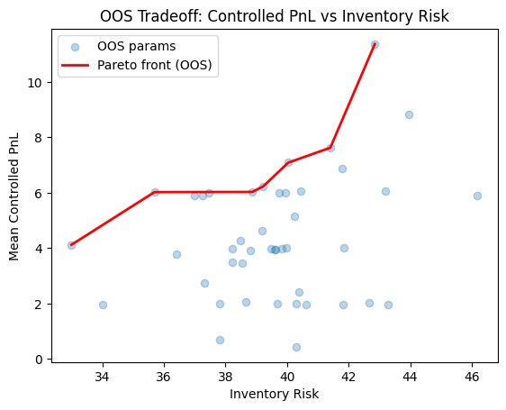

# Project: Market Making Tradeoff Simulator

## Overview

This project studies a market maker's tradeoff between **spread capture**, **inventory risk**, and **hedging cost** in a noisy and uncertain market environment

Rather than optimizing for raw PnL - which is dominated by mark-to-market noise - the focus is on **controlled PnL** and **robust decision-making across many market simulations.**

The core question I try to answer is:

> **Which quoting and hedging behaviors remain profitable across many stochastic paths, not just a single realization?**

## Model Summary

### Price Process

- Midprice follows a geometric Brownian motion
- Volatility is annualized and scaled by √Δt
- Common random numbers are used across parameter evaluations

### Order Flow

- Buy/Sell orders arrive randomly
- Order flow is exogenous

### Quoting

- Spread is proportional to estimated volatility
- Quotes are skewed linearly with inventory
```ini
skew = −α × inventory
```

### Hedging

- Inventory is hedged externally when it exceeds a volatility-scaled threshold
- Hedge execution includes fixed slippage and linear market impact

Hedging decisions are driven solely by inventory risk; execution costs are accounted for ex-post rather than used as decision constraints.

## PnL Decomposition

Total PnL is decomposed as:
```ini
Total_PnL = Controlled_PnL + Mark-to-Market_Noise
```
where:
- Controlled_PnL = spread revenue - hedge cost
- Mark-to-Market_Noise = inventory x price movement

Only **controlled PnL** is used for optimization and evaluation, since MTM dominates variance and is not directly controllable by the strategy.

## Evaluation Methodology

Experiments are performed via a single runner script -  `run_experiment.py`. Each parameter set is evaluated across many independent price paths

For each set, we compute:
- mean controlled PnL
- standard deviation of PnL
- t-statistic
- mean inventory volatility
- mean hedge cost

A parameter set is considered statistically meaningful only if:
```perl
t-stat ≥ 2
```

Out of sample validation is performed by re-evaluating statistically significant parameter regimes on unseen random seeds.

## Optimization Perspective

Rather than selecting a single "best" parameter set, we focus on **Pareto efficient tradeoffs** between:
- controlled PnL (↑)
- inventory risk (↓)

This reflects the reality of market making which involves choosing a position on the tradeoff surface, not maximizing a single objective.

## Baseline Comparison

During development, exploratory comparisons were conducted against a simple baseline strategy with fixed spreads, no inventory skwe, and static hedging thresholds (see `research` branch).

These comparisons helped sanity-check results but are not included in the main evaluation pipeline to keep the core model minimal.

## Calibration Notes

The model is calibrated to a 10-minute time scale using realistic equity-market magnitudes:
- annualized volatility ≈ 15–25%
- bid-ask spreads on the order of a few basis points
- moderate order arrival rates per interval

This calibration avoids microstructure-level noise while keeping inventory and execution dynamics interpretable.

## Results

Out-of-sample results at a 10-minute resolution show a smooth tradeoff between controlled PnL and inventory risk. Allowing moderately higher inventory exposure increases expected spread capture, but gains are incremental rather than explosive, reflecting the thin margins of market making under realistic execution costs.

Absolute PnL magnitudes are intentionally small, reflecting a single unlevered instrument; market-making profitability arises from scaling small per-trade edges rather than large standaline returns.

The figure below shows the out-of-sample tradeoff between controlled PnL and inventory risk for statistically significant parameter sets (t-stat ≥ 2). The Pareto frontier highlights a robust region of strategies that achieve higher spread capture at the cost of increased inventory exposure.



Across the parameter space explored, a substantial fraction of configurations exhibited statistically significant controlled PnL in-sample. However only a smaller subset (~30-40%) remained stable out-of-sample, forming a coherent tradeoff region rather than isolated optima.

## Key Findings

- Raw PnL is extremely noisy and misleading for optimization
- Controlled PnL reveals stable and repeatable structure
- Only a subset of parameter space (~40%) produces statistically significant performance
- Volatility-aware inventory control materially reduces tail inventory exposure

## Limitations

- Order flow is independent of quotes (no adverse selection)
- Hedge execution assumes immediate fills with simplified impact
- The model does not learn parameters online

These simplifications are intentional to isolate core tradeoffs

## Possible Extensions

- Quote-dependent fill probabilities
- Adverse selection modelling
- Online learning of inventory skew
- Regime-dependent volatility

## Repository Structure

```graphql
simulator.py      # price generation and single-path simulation
market_maker.py  # quoting, hedging, and controlled PnL logic
optimizer.py     # Monte-Carlo evaluation and Pareto analysis
```
Exploratory experiments and alternative implementations are preserved on the `research` branch

## Takeaway

This project emphasizes **robust reasoning under uncertainty**, not curve-fitting. The goal is not to find a single optimal parameter set, but to understand which behaviors survive noise.
